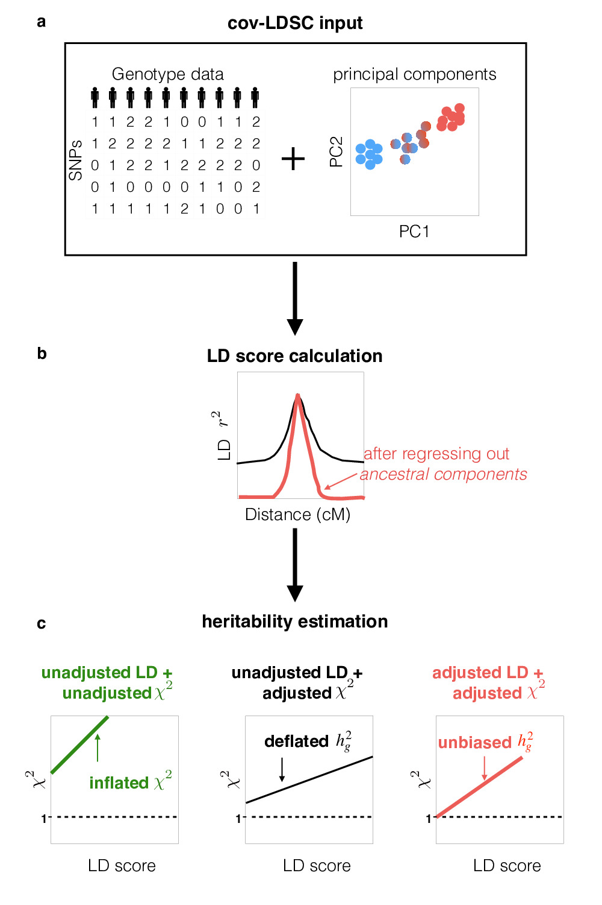

`cov-LDSC` (covariance-adjusted LD Score Regression) is a tool extended from original LDSC to measure heritability from GWAS summary statistic in admixed populations.

## cov-LDSC
covariate-adjusted LD score regression (cov-LDSC) is a method to provide robust hg2 estimates from GWAS summary statistics and in-sample LD estimates in admixed populations. Check out the latest [preprint](https://www.biorxiv.org/content/early/2018/12/22/503144) of cov-LDSC on bioRxiv.



## Repo Contents
- [ldscore](./ldscore): scripts used for running LDSC 
- [example](./example): example files used in demo 
- [manuscript](./manuscript): data and scripts to reproduce the result in the manuscript 

## Getting Started
To download cov-ldsc you should clone this repository via the command
```
git clone https://github.com/immunogenomics/cov-ldsc.git
```
## Estimating LD score
The first step is to acquire global principal components (PCs) from the raw whole-genome genotypes. Different methods can be applied to measure PCs. We applied EIGENSOFT(Patterson et al. 2006) on AMR whole genome LD pruned data .
The PC files should be formatted that the first two columns of the covariance file are family IDs and individual IDs and the subsequent columns are the covariates that you want to include in adjusting LD.

```
HG00551 HG00551 -0.0478 -0.0194 -0.0485 0.0113 0.0383 -0.0785 0.1377 -0.0498 -0.0785 0.0798
HG00553 HG00553 -0.0465 0.0597 -0.0462 0.0082 -0.0131 0.0067 0.0053 0.0502 -0.1537 0.0290
HG00554 HG00554 -0.0519 -0.0212 -0.0721 0.0084 0.0374 -0.0398 0.0524 0.0519 0.0268 0.0743
HG00637 HG00637 -0.0533 0.0261 -0.0472 0.0133 0.0306 -0.0682 0.0588 -0.0675 0.0584 -0.0585
```
When estimating LD score in an admixed population, you should include the genome-wide covariance file with the flags `--cov`. We recommend to use 20cM for LD window size (`--ld-wind-cm`).
For computational efficiency, we recommend to split the whole genome to chromosomes and run multiple chromosomes in parallel. 

## Demo 
We used 1000 Genome Project Ad Mixed American (AMR) chromosome 21 data as a demo. We provide a pre-generated 10PC file on AMR_chr21/AMR.evec. To get cov-LDscore, run the command: 
```
python ldsc.py --bfile example/AMR_chr21/AMR_chr21_cm --l2 --ld-wind-cm 20 --cov example/AMR_chr21/AMR.evec --out example/AMR_chr21/AMR_chr21_20cm_covldsc
```

There are four output files:
`.M` files contain number of SNPs in LD score calculation; `.M_5_50` is the number of SNPs with MAF >5% in LD score calculation; `.ldscore.gz` files have per-SNPs LD score; and '.log' files are the summary files. 
Below is the summary file for the example we used and the run time is around 3min on local machine: 
```
*********************************************************************
* LD Score Regression (LDSC)
* Version 1.0.0
* (C) 2014-2015 Brendan Bulik-Sullivan and Hilary Finucane
* Broad Institute of MIT and Harvard / MIT Department of Mathematics
* GNU General Public License v3
*********************************************************************
Call: 
./ldsc.py \
--ld-wind-cm 20.0 \
--out example/AMR_chr21/AMR_chr21_20cm_covldsc \
--bfile example/AMR_chr21/AMR_chr21_cm \
--cov example/AMR_chr21/AMR.evec \
--l2  

Beginning analysis at Thu Jan 10 15:16:20 2019
Read list of 15632 SNPs from example/AMR_chr21/AMR_chr21_cm.bim
Read list of 347 individuals from example/AMR_chr21/AMR_chr21_cm.fam
Reading genotypes from example/AMR_chr21/AMR_chr21_cm.bed
After filtering, 15632 SNPs remain
Estimating LD Score.
Writing LD Scores for 15632 SNPs to example/AMR_chr21/AMR_chr21_20cm_covldsc.l2.ldscore.gz

Summary of LD Scores in example/AMR_chr21/AMR_chr21_20cm_covldsc.l2.ldscore.gz
         MAF        L2
mean  0.2584   22.8973
std   0.1302   14.2304
min   0.0504    0.4198
25%   0.1441   13.3488
50%   0.2464   19.3735
75%   0.3703   28.4681
max   0.5000  106.4251

MAF/LD Score Correlation Matrix
       MAF     L2
MAF  1.000  0.264
L2   0.264  1.000
Analysis finished at Thu Jan 10 15:19:30 2019
Total time elapsed: 3.0m:10.28s
```

## Heritability estimation
For estimating heritability in admixed populations, you can follow the same command used in original LD score regression. Refer to instructions of original LD score regression : https://github.com/bulik/ldsc/wiki

## Prerequisites 
1. `Python (3 > version >= 2.7)`
2. `bitarray: 0.8` 
3. `numpy: 1.12` 
4. `pandas: 0.20` 
5. `scipy: 0.18` 

## [License](https://github.com/immunogenomics/cov-ldsc/blob/master/LICENSE)

## Citations 
For citing code or the paper, please use the [bioRxiv](https://www.biorxiv.org/content/early/2018/12/22/503144)


